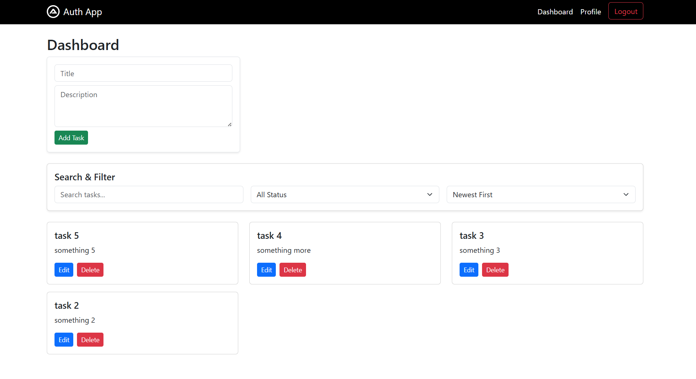
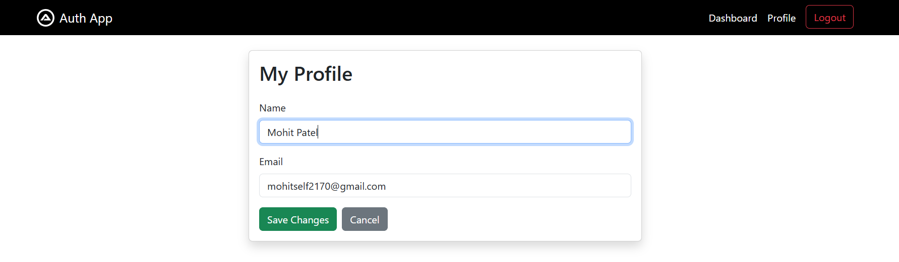
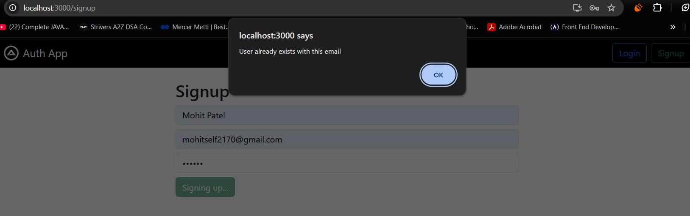
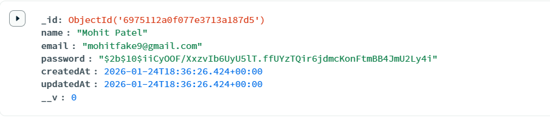
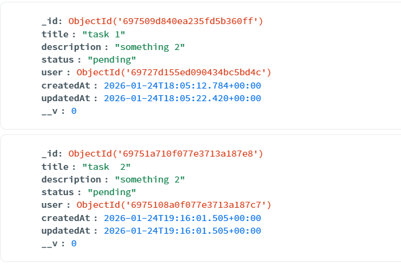

# Authentication Dashboard - Full Stack Web Application

A scalable web application with user authentication, profile management, and task CRUD operations built with the MERN stack (MongoDB, Express, React, Node.js).

## 🚀 Features

### Authentication
- ✅ User registration with validation
- ✅ Secure login with JWT tokens
- ✅ Password hashing using bcrypt
- ✅ Protected routes requiring authentication
- ✅ Token expiration (24 hours)

### User Profile
- ✅ View user profile information
- ✅ Update name and email
- ✅ Real-time validation

### Task Management (CRUD)
- ✅ Create tasks with title and description
- ✅ Read all tasks for logged-in user
- ✅ Update existing tasks
- ✅ Delete tasks with confirmation
- ✅ Task status tracking (pending, in-progress, completed)

### Search & Filter
- ✅ Search tasks by title or description
- ✅ Filter by status (pending/in-progress/completed)
- ✅ Sort by date (newest/oldest) or title

### UI/UX
- ✅ Responsive design with Bootstrap 5
- ✅ Loading states and error handling
- ✅ Clean, intuitive interface
- ✅ Mobile-friendly navigation

## 🛠️ Tech Stack

### Frontend
- **React.js** - UI library
- **React Router** - Client-side routing
- **Axios** - HTTP requests
- **Bootstrap 5** - CSS framework

### Backend
- **Node.js** - Runtime environment
- **Express.js** - Web framework
- **MongoDB** - Database
- **Mongoose** - MongoDB
- **JWT** - Authentication tokens
- **bcrypt** - Password hashing


The Dashboard Page


Profile Section which can be updated 


Signup Page (error if user already exists)


Name,Email and Password(Hashed) stored in MongoDB


Tasks stored in MongoDB with thier Title, Desc., Status, Creation & Updation (Date & Time)

## 📁 Project Structure
```
auth-dashboard/
├── backend/
│   ├── middleware/
│   │   └── authMiddleware.js      # JWT verification
│   ├── models/
│   │   ├── User.js                # User schema
│   │   └── Task.js                # Task schema
│   ├── routes/
│   │   ├── auth.js                # Signup/Login routes
│   │   ├── profile.js             # Profile routes
│   │   └── tasks.js               # Task CRUD routes
│   ├── index.js                   # Server entry point
│   ├── .env                       # Environment variables
│   └── package.json
│
├── frontend/
│   ├── public/
│   ├── src/
│   │   ├── components/
│   │   │   ├── Navbar.js          # Navigation bar
│   │   │   └── TaskCard.js        # Task display card
│   │   ├── pages/
│   │   │   ├── Login.js           # Login page
│   │   │   ├── Signup.js          # Registration page
│   │   │   ├── Dashboard.js       # Main dashboard
│   │   │   └── Profile.js         # User profile page
│   │   ├── App.js                 # Main app component
│   │   └── index.js               # React entry point
│   └── package.json
│
├── API_DOCUMENTATION.md           # API endpoint documentation
├── SCALING_NOTES.md               # Production scaling guide
└── README.md                      # This file
```

## 🔧 Installation & Setup

### Prerequisites
- Node.js (v14 or higher)
- MongoDB (local or Atlas account)
- npm or yarn

### 1. Clone the Repository
```bash
git clone https://github.com/yourusername/auth-dashboard.git
cd auth-dashboard
```

### 2. Backend Setup
```bash
cd backend
npm install
```

Create a `.env` file in the `backend` directory:
```env
MONGO_URI=your_mongodb_connection_string
JWT_SECRET=your_super_secret_key
PORT=5000
NODE_ENV=development
CLIENT_URL=http://localhost:3000
```

Start the backend server:
```bash
npm start 
or
node index.js
```

Server will run on `http://localhost:5000`

### 3. Frontend Setup
```bash
cd frontend
npm install
```

Start the React app:
```bash
npm start
```

App will run on `http://localhost:3000`

## 🎯 Usage

### 1. Register a New Account
- Navigate to `http://localhost:3000/signup`
- Fill in name, email, and password (min 6 characters)
- Click "Signup" - you'll be auto-logged in and redirected to Dashboard

### 2. Login
- Navigate to `http://localhost:3000/login`
- Enter your email and password
- Click "Login" to access Dashboard

### 3. Manage Tasks
- **Create**: Fill the form at the top of Dashboard
- **Read**: View all your tasks in cards below
- **Update**: Click "Edit" on any task, modify, then click "Update"
- **Delete**: Click "Delete" (with confirmation prompt)

### 4. Search & Filter
- Use the search bar to find tasks by title/description
- Filter by status using the dropdown
- Sort tasks by newest, oldest, or title

### 5. Profile Management
- Click "Profile" in navbar
- View your current information
- Click "Edit Profile" to update name or email
- Click "Save Changes" to update

### 6. Logout
- Click "Logout" button in navbar
- You'll be redirected to login page
- Token is cleared from localStorage

---

## 🔐 Security Features

- ✅ **Password Hashing**: bcrypt with salt rounds
- ✅ **JWT Authentication**: Secure token-based auth
- ✅ **Protected Routes**: Middleware verification
- ✅ **Input Validation**: Client and server-side
- ✅ **Error Handling**: Comprehensive error messages
- ✅ **CORS Protection**: Configured for specific origins
- ✅ **Token Expiration**: 24-hour validity

---

## 📚 API Documentation
Full API documentation available in [API_DOCUMENTATION.md](./API_DOCUMENTATION.md)

### Key Endpoints

| Method | Endpoint | Description | Auth Required |
|--------|----------|-------------|---------------|
| POST | `/api/auth/signup` | Register new user | No |
| POST | `/api/auth/login` | Login user | No |
| GET | `/api/profile` | Get user profile | Yes |
| PUT | `/api/profile` | Update profile | Yes |
| POST | `/api/tasks` | Create task | Yes |
| GET | `/api/tasks` | Get all tasks | Yes |
| GET | `/api/tasks/:id` | Get single task | Yes |
| PUT | `/api/tasks/:id` | Update task | Yes |
| DELETE | `/api/tasks/:id` | Delete task | Yes |

---

## 🚀 Deployment

### Backend Deployment Options
- **Heroku**: Easy deployment with Git
- **AWS EC2**: Scalable cloud solution

### Frontend Deployment Options
- **Vercel**: Automatic deployments from Git (Recommended)
- **Netlify**: Similar to Vercel
- **GitHub Pages**: Free static hosting

### Database
- **MongoDB Atlas**: Cloud-hosted MongoDB (Free tier available)

See [SCALING_NOTES.md](./SCALING_NOTES.md) for production scaling strategies.

---

## 🧪 Testing

### Manual Testing
1. Test user registration with various inputs
2. Test login with correct/incorrect credentials
3. Create multiple tasks
4. Test search with different queries
5. Test filter by different statuses
6. Update and delete tasks
7. Update profile information
8. Test logout functionality

### API Testing
Use the provided cURL commands in `API_DOCUMENTATION.md` or import to Postman.


## 📈 Scaling for Production
Key recommendations for scaling to production:

1. **Environment Variables**: Use proper env management
2. **Rate Limiting**: Prevent API abuse
3. **Caching**: Implement Redis for performance
4. **Load Balancing**: Distribute traffic across instances
5. **Database Optimization**: Indexes, replica sets
6. **Monitoring**: Error tracking and analytics
7. **CDN**: Serve static assets efficiently

Full details in [SCALING_NOTES.md](./SCALING_NOTES.md)


## 🐛 Known Issues & Limitations

- JWT tokens stored in localStorage (consider httpOnly cookies for production)
- Single-page tasks list (add pagination for 100+ tasks)
- No email verification on signup
- No password reset functionality
- No real-time updates (consider WebSockets)

## 🔮 Future Enhancements

- [ ] Email verification
- [ ] Password reset flow
- [ ] Profile picture upload
- [ ] Task categories/tags
- [ ] Task due dates and reminders
- [ ] Collaborative tasks (sharing)
- [ ] Dark mode toggle
- [ ] Export tasks to CSV/PDF
- [ ] Advanced analytics dashboard
- [ ] Mobile app (React Native)

## 🤝 Contributing

Contributions are welcome! Please follow these steps:

1. Fork the repository
2. Create a feature branch (`git checkout -b feature/AmazingFeature`)
3. Commit your changes (`git commit -m 'Add some AmazingFeature'`)
4. Push to the branch (`git push origin feature/AmazingFeature`)
5. Open a Pull Request

---

## 📝 License

This project is open source and available under the [MIT License](LICENSE).

---

## 👨‍💻 Author

**Mohit Patel**

- GitHub: [@MohitPatel2170](https://github.com/MohitPatel2170)
- Email: [mohit.patel2170@example.com]


## 🙏 Acknowledgments
- Bootstrap team for the UI framework
- MongoDB team for the excellent database
- React community for amazing documentation
- Express.js for the minimal web framework

---

## 📞 Support

If you encounter any issues or have questions:

1. Check the [API Documentation](./API_DOCUMENTATION.md)
2. Review [Scaling Notes](./SCALING_NOTES.md)
3. Open an issue on GitHub
4. Contact the author via Email or DM on LinkdIN

---

## 🎓 Learning Resources

This project demonstrates:
- RESTful API design
- JWT authentication
- CRUD operations
- React hooks (useState, useEffect)
- MongoDB with Mongoose
- Protected routes
- Form validation
- Error handling
- Responsive design

**Built with ❤️ using the MERN stack** 

**MOHIT PATEL**
